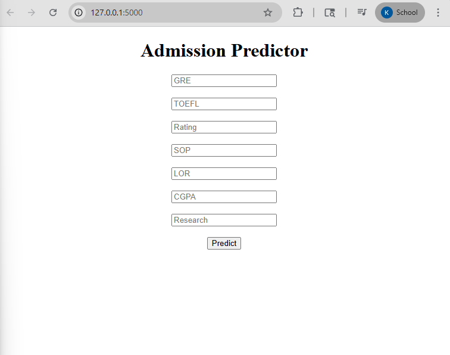
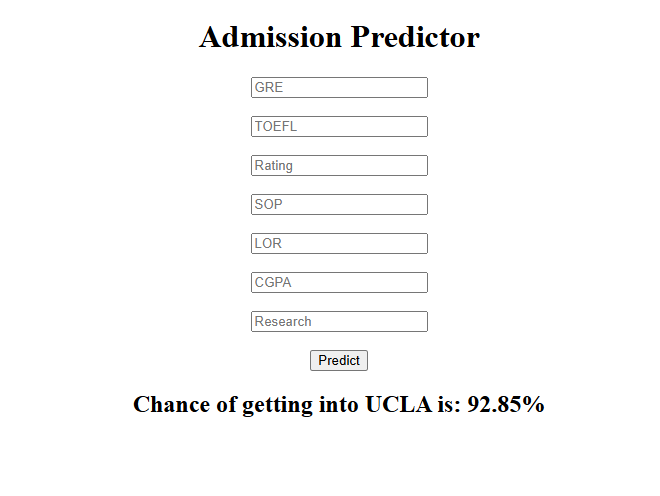

# 🎓 Admission Predictor (ML + Flask Web App)


---

## 📌 Overview

**Admission Predictor** is a Machine Learning web application that predicts the probability of a student getting admission into a university based on their academic profile.

The model is trained using **Linear Regression** and deployed using **Flask**, allowing users to input their details and receive real-time predictions through a web interface.

---

## 🚀 Features

* 🎯 Predict admission probability instantly
* 🌐 Interactive web interface using Flask
* 📊 Uses real-world academic parameters
* ⚡ Fast and lightweight ML model
* 🔄 End-to-end pipeline (Training → Deployment)

---

## 🛠️ Tech Stack

* **Frontend:** HTML, CSS
* **Backend:** Flask
* **Machine Learning:** scikit-learn
* **Language:** Python

---

## 📊 Input Parameters

* GRE Score
* TOEFL Score
* University Rating
* SOP Strength
* LOR Strength
* CGPA
* Research Experience

---

## 🧠 How It Works

1. User enters academic details in the web form
2. Data is sent to Flask backend
3. Trained Linear Regression model processes input
4. Output is displayed as **Admission Probability (%)**

---

## 📸 Screenshots

### 🖥️ Input Form



### 📈 Prediction Output



> 📌 Add your screenshots in a `screenshots/` folder in your repo

---

## 📂 Project Structure

```
admission-predictor/
│
├── app.py
├── model.pkl
├── Admission_predictor.ipynb
├── templates/
│   └── index.html
├── screenshots/
│   ├── input.png
│   └── output.png
└── README.md
```

---

## ⚙️ Installation & Setup

### 1️⃣ Clone the Repository

```
git clone https://github.com/your-username/admission-predictor.git
cd admission-predictor
```

### 2️⃣ Install Dependencies

```
pip install -r requirements.txt
```

### 3️⃣ Run the Application

```
python app.py
```

### 4️⃣ Open in Browser

```
http://127.0.0.1:5000/
```

---

## 📈 Model Details

* Algorithm: **Linear Regression**
* Evaluation Metric: **R² Score**
* Data Preprocessing: Feature selection & cleaning

---

## 💡 Future Improvements

* 🔥 Add advanced models (Random Forest, XGBoost)
* 🎨 Improve UI with Bootstrap
* ☁️ Deploy on cloud (Render / AWS)
* 📊 Add visualization dashboard

---

## 🤝 Contributing

Contributions are welcome! Feel free to fork the repo and submit a pull request.

---

## 📜 License

This project is licensed under the MIT License.

---

## 🙌 Acknowledgement

Inspired by real-world admission prediction datasets and ML deployment practices.

---

⭐ If you like this project, give it a star!
